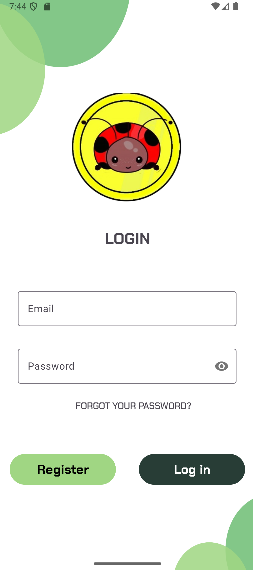
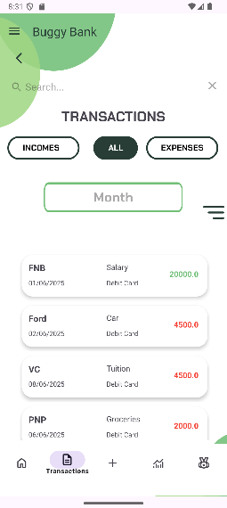
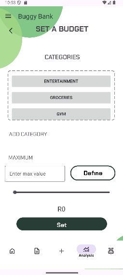

# 🐞 BuggyBank – Personal Budget Tracker

## 📱 Overview

**BuggyBank** is an Android budgeting app built with **Kotlin**, **AndroidX**, and **Firebase**. It empowers users to track income, expenses, and category-specific budgets while visualizing their financial habits through interactive graphs and detailed reports.

---

## Core Features

### 🔐 Authentication


* Sign Up & Log In with Firebase Authentication
* Secure user data by UID

### 📊 Dashboard



* Wallet overview showing current balance
* Graph view of income vs. expenses (AnalysisFragment)
* Progress bars for budget usage
* Quick access to downloadable reports

### 📂 Transactions

* Add transactions with: title, type, amount, date/time, category, payment method, description, and optional image
* Search bar in transaction records for quick filtering
* Edit / 🗑 Delete entries with confirmation
* Export transaction reports

### 🧩 Categories & Budgets


* Create custom **Income** and **Expense** categories
* Edit & 🗑 Delete categories (blocked if in use)
* Set and manage category-specific budgets with duplicate checks and overspend warnings

---

## ✨ Extra Features

* **Currency Conversion** page
* **Built-in Calculator** for quick arithmetic
* **Interactive Tutorial** guiding first-time users through app workflows
* **Profile Settings** for user preferences

---

## 🛠 Tech Stack

| Tool            | Purpose                              |
| --------------- | ------------------------------------ |
| Kotlin          | Core Android logic                   |
| AndroidX        | UI components & lifecycle management |
| Material Design | Theming & widgets                    |
| Firebase Auth   | User authentication                  |
| Firebase DB     | Realtime data storage                |
| MPAndroidChart  | Charts and graphs                    |
| FileProvider    | Camera & gallery image handling      |

---

---

## 🔧 Getting Started

1. **Clone** the repo:

   ```bash
   git clone [https://github.com/VCNMB-3rd-years/BuggyBank.git]
   ```
2. **Open** in Android Studio.
3. **Configure Firebase**:

   * Create a Firebase project.
   * Enable Realtime Database & Authentication.
   * Download `google-services.json` into `app/`.
4. **Sync Gradle** and **Run** on an emulator or device.

---

## 🗂 New Features Implemented (Part 3)

* **Search Bar** in Transaction Records for quick lookup
* **Currency Conversion** page to convert between currencies
* **Built-in Calculator** for on-the-fly calculations
* **Downloadable Reports**: export spending summaries as files
* **Interactive Tutorial** guiding first-time users
* **Profile Settings** for account and preferences management

---

## 🤝 Contributing

Contributions are welcome! Fork the repo and open a pull request.

## 📄 License

MIT License © 2025 Buggy Bank
